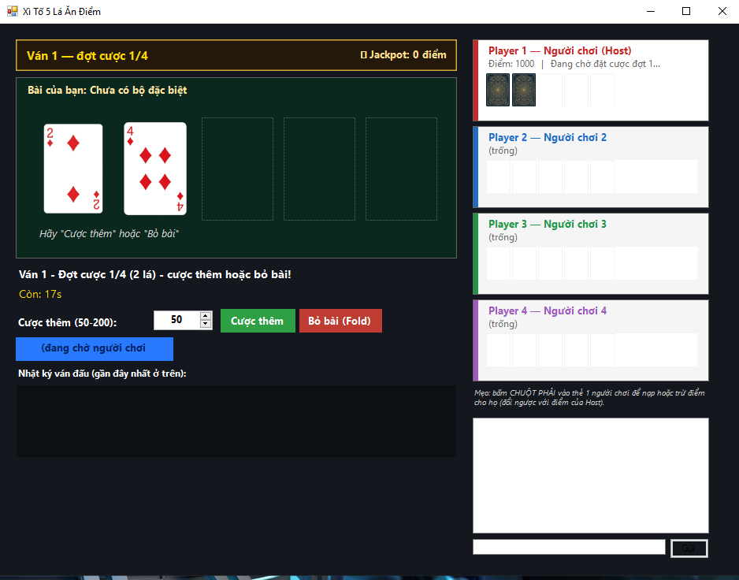

# Xì Tố 5 Lá Ăn Điểm

<p align="center">
  
</p>

Trò chơi bài Xì Tố 5 Lá (5-Card Stud) nhiều người chơi qua mạng LAN hoặc
Online. Mỗi ván chia 4 vòng bài, sau mỗi vòng người chơi chọn cược thêm
hoặc bỏ bài. Ai bài mạnh hơn thắng điểm của đối thủ. Kiến trúc
star-topology (NetworkHub.vb / NetworkPeer.vb), Host chia bài và tính kết
quả, Client chỉ nhận dữ liệu từ Host.

# Các tính năng chính
- Hỗ trợ nhiều người chơi cùng lúc qua mạng LAN/Online
- 4 vòng cược (2 → 3 → 4 → 5 lá), mỗi vòng cược thêm hoặc bỏ bài
- **Bỏ bài (Fold)** mất luôn điểm đã cược trước đó, không hoàn lại
- So bài đầy đủ 10 loại, phân định bằng chất khi hòa
- Mỗi người bắt đầu với **1000 điểm**, cược **50–200 điểm/vòng**
- Hiển thị gợi ý bộ bài đang hình thành trong khi chưa đủ 5 lá
- Sprite lá bài từ thư mục `Assets/Cards/`

# Thứ tự bài (yếu → mạnh)
| Hạng | Loại bài |
|------|----------|
| 0 | Mậu thầu (bài rác) |
| 1 | Đôi |
| 2 | Thú (2 đôi) |
| 3 | Sám cô |
| 4 | Sảnh |
| 5 | Thùng (cùng chất) |
| 6 | Cù lũ (Sám cô + Đôi) |
| 7 | Tứ quý |
| 8 | Thùng phá sảnh |
| 9 | Sảnh Rồng (10-J-Q-K-A cùng chất) |

> Khi 2 bộ cùng loại: so điểm phụ (TieBreak). Nếu vẫn bằng: chất cao hơn thắng (Chuồn < Rô < Cơ < Bích).

# Luật chơi
| Tình huống | Quy tắc |
|------------|---------|
| Bắt đầu ván | Host chia 2 lá cho mỗi người, không cần cược trước |
| Mỗi vòng | Từng người chọn **Cược thêm** (50–200 điểm) hoặc **Bỏ bài** |
| Bỏ bài | Mất luôn toàn bộ điểm đã cược từ đầu ván, không được so bài |
| Sau vòng 4 | Những người chưa bỏ bài lật bài so — ai mạnh hơn ăn điểm tương ứng |
| Tính thưởng | Người thắng ăn điểm bằng **mức cược nhỏ hơn** trong 2 người (so từng cặp) |
| Hòa | Không đổi điểm |

# Cách build
Yêu cầu: **.NET Framework 4.x** đã cài sẵn trên Windows.

```
buildexe_xito5la.bat
```

File `.exe` xuất ra cùng thư mục với tên `GamePvP-XiTo5La.exe`.

> Đặt thư mục `Assets/Cards/` (chứa sprite lá bài: `AS.png`, `KH.png`, `10D.png`, v.v.)
> cạnh file `.exe` để hiển thị hình lá bài. Game vẫn chạy nếu thiếu ảnh.

# Cách chơi

**Host (tạo phòng):**
1. Chọn **Tạo phòng** → nhập port → bấm Host
2. Chờ người chơi khác vào phòng
3. Bấm **Chia bài** để bắt đầu mỗi ván mới

**Client (vào phòng):**
1. Chọn **Vào phòng** → nhập IP của Host và port → bấm Join
2. Chờ Host chia bài
3. Mỗi vòng: bấm **Cược thêm** (nhập số điểm 50–200) hoặc **Bỏ bài**

# Cấu trúc file
| File | Vai trò |
|------|---------|
| `XiTo5LaGame.vb` | Logic game: chia bài, đánh giá 10 loại bộ bài, cược, so bài, tính điểm |
| `Form1.vb` | Giao diện, hiển thị lá bài, điều khiển cược, chat |
| `NetworkHub.vb` | Phía Host: quản lý nhiều kết nối Client (star-topology) |
| `NetworkPeer.vb` | Phía Client: kết nối đến Host |
| `Program.vb` | Entry point |
| `buildexe_xito5la.bat` | Script build bằng vbc.exe |
